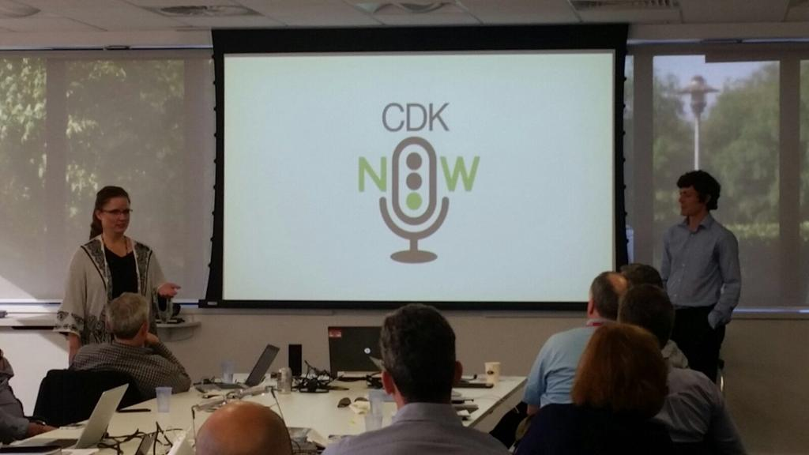

### University

I have a masters degree in Physics from Imperial College London. This is where I did my first programming - the first and second years had mandatory courses using C++. Unsurprisingly, they were very much focused on the Physics and the results you could generate from the scenario you were trying to simulate, although your code was reviewed and worth a few marks. I chose all the programming courses available in the third and fourth years, including a Computational Physics course and lab options - an introduction to assembler on an ATMega128 and an image processing task using Matlab. I also chose a computational subject for my masters project (Stellar Microvariability), analysing data from the Keplar Space Telescope. Keplar was primarily intended to find exoplanets using the transit method - when a planet passes between the star and the observer, it blocks some of the light, so you can measure a dip in the brightness. Regular dips  of the same size may indicate the presence of a planet - for example, if you were observing our Sun from a distance, the transit of the Earth would cause a dip every 365 days. Of course, the other planets would cause dips as well. To help find the planets amongst the noise, it is important to have an understanding of the inherent variability of stars. The brightness of a star varies through a variety of mechanisms, with timescales ranging from hours to decades. Our project investigated some of these mechanisms, and used mathematical analysis to attempt to classify the variability of the measured stars. You can read my final report [here](../../stellar_microvariability.pdf).

Throughout my time at Imperial, I was heavily involved with the cricket club, holding the positions of Treasurer, Secretary and President in my second, third and fourth years respectively. The club offered net practise twice a week throughout the first two terms, and matches in the summer. During my time there, nets were held at the indoor schools at London's two test match grounds, Lords and the Oval; a remarkable opportunity for a cricket lover. Because of this, nets were often oversubscribed and attendance had to be carefully monitored. Members who reserved a space and failed to attend (without a good excuse) lost priority for future sessions. In my early years, this was a manual effort that fell to the Secretary, who typically tried to keep track of things in a spreadsheet or similar, often needing to chase down information from those who were actually in attendance at the session.

Having lived through this pain as Secretary in my third year, I spend the summer building a web application to streamline the process. It enabled the Secretary to enter the expected attendees produce a register that could be printed out by whoever was running the session. This would also include money owed by members who had not paid for previous nets. At the session, attendance and payment information could be collected, and then entered back into the application.

Looking back now, I have mixed feelings about what I built! It was, in many ways, an amateur effort, reflecting my status as an amateur at the time. I did not use source control, had no unit tests, and the UI would not have looked out of place in the late 90s. On the other hand, I still developed a working application that provided real value to its users, with technologies I had never used before (HTML/PHP/MySQL), and gained my first experience building software for humans.

### ADP Dealer Services/CDK Global

#### Toolset Team
 
After graduating, I got my first software development job with ADP Dealer Services (later CDK Global). They are a provider of software to car dealerships, helping them to manage everything concerning a dealership day to day - service and sales appointments, finance, parts, aftersales etc. I joined the Toolset team, which maintained the proprietary language that the software was written in (KCML), and related tools and utilities. After working on university or hobby projects, either solo or in a pair, working with a team of professional developers made me realise how many other skills I would need beyond just my ability to write code. I learned about version control, documentation, automated testing, issue tracking, building for different operating systems and architectures, and working and communicating with other teams to provide value to our users. I will always be grateful for the support and wisdom of my first team. While working with the Toolset team, I got my first experience of working with Javascript. The historic architecture of CDK's applications is a client-server model, with a Windows forms application acting as the client. In an attempt to support other platforms, the team had built a Javascript client that could interact with the existing server. I spent much of my first 2-3 years at CDK working on this; trying to align the behaviour of the Javascript client to the existing Windows one - even when the behaviour was dubious! The requirement was not to change the application code, and the application had been written against the Windows client. Alongside Javascript, I picked up some jQuery and CSS.

Since the aim of the Javascript client was to perfectly mimic the existing Windows client, it inherited the latter's dated UI. When the company ran a POC project to explore the viability of a browser client with a modern interface, I was asked to join based on my experience with the existing Javascript client. The remit was similar in the sense that the application code could not change, and so the data flowing between server and client needed to mimic the existing Javascript client. However, rather than needing to match the look and feel exactly, we were to try and make it feel like a modern web application. We chose to use React for our front-end components, partly because it could be mapped nicely onto the windows forms components defined by the application. We also used bootstrap to facilitate a responsive design, and flux, and later redux, for state management. The project made some progress, but ultimately we never managed to find an approach that could produce a modern-feeling version of every one of the many thousands of forms within the application.

This project was very important for my professional development because it was the first time I worked at or near the cutting edge of the Javascript ecosystem. I encountered npm for the first time, which I have probably used every day since! I also used testing tools such as Mocha, Chai, and Sinon, which have many similarities with Jest, my current preferred tool. I also became a fan of React - I like the way it encourages you to think about, and build, reusable components that are easy to share across a team or even a whole organisation.

#### FastPath

At the start of 2017, CDK's then-CTO, Rajiv Amar, launched a program called FastPath, intended to identify and develop associates with the potential to become technical leaders within CDK. I applied successfully and joined 14 others at the launch event in Portland, Oregon. We spent the week receiving training on Domain Driven Design, design thinking, personality types and more. We were divided into teams, provided with a couple of mentors (who continually assisted us and challenged us in equal measure) and given projects. The week culminated in a presentation to Rajiv and his leadership team on how we intended to complete them. My team had been asked to explore AI virtual assistants (e.g. Amazon's Alexa and Google's Assistant) and how we might utilise them within the automotive sector. We were given an extraordinary amount of freedom in how we approached our projects, and encouraged to pursue whatever we thought had merit. After some initial experimentation, we decided to build a skill aimed at internal CDK associates to help them better find the information they needed on a daily basis. This choice was made mostly for practical reasons: our team was distributed worldwide (we had members in the USA, Finland and India, in addition to myself) and the needs of CDK Associates are much more consistent than the needs of car dealers worldwide. It also meant we had direct access to our users every day. We also wanted to demonstrate the power of these platforms to the business, in the hope other teams would build on our work to produce Voice Assistants for the automotive market. One of the most impressive features we were able to show is that assistants can be platform-agnostic, and ours supported both Alexa and the Google Assistant equally well from a single back end. Platform agnosticism was designed into the architecture from day one, so we could have expanded to other assistants (e.g. Microsoft's Cortana) in the future. We also had some other tricks, like being able to email a user the results of their query, or display relevant information on a screen.

The FastPath program culminated in the different teams presenting their work to CDK's Executive Leadership Team. All the projects were well received, and as a final surprise we revealed that we had all worked together so that you could interact with the other two projects through our Voice Assistant.

#### Fortellis

After my success on the FastPath programme, Rajiv asked me to join the team he was building to work on what would become the Fortellis Automotive Commerce Exchange (https://fortellis.io). Fortellis aims to revolutionise the automotive industry by providing connections and integrations for software that has historically been unavailable to integrate with.

At heart, Fortellis is an API Platform. The aim was to define standard APIs for different sections of the automotive industry (such as Service Appointments, or Vehicle Data) and encourage different businesses to provide implementations. Application developers could then build their software against a single interface without needing to worry about which system would ultimately fulfil the request. Dealerships would then purchase these applications, connect them to whichever backend system they already used, and Fortellis would ensure API calls were routed to the appropriate backend.

We decided that rather than build the routing functionality from scratch, we would make use of [Apigee Edge](https://docs.apigee.com/). I was tasked with learning this tool and how best to use it to meet our needs. Apigee Edge exposes APIs through entities called API Proxies. We would need to create a new API Proxy every time a user uploaded an API Specification to Fortellis, so this process needed to be automatic. We needed a way to add all of our required logic to each API Proxy, to handle security, routing, logging etc. Apigee has a couple of options for re-using code, and we decided that shared flows were the best approach in our case. We built shared flows for all our logical components (e.g. routing). When a user uploads their spec, we use a command-line tool provided by Apigee to create a new Proxy for it, add our shared flows to the proxy, and the API is ready to use with no manual intervention.

I also took responsibility for implementing the actual routing behaviour. Fortellis decides where to route a given request based on the API that has been called and the dealership context of the call (i.e. if I'm calling the Service Appointments API, then the dealership context represents which Dealership's appointments I am requesting). Since this logic is executed for every single API call passing through the platform, its performance is critical. I proposed that we provide a denormalised data store where we can look up all data required at runtime, so we never have to make more than one call. We also cache this request very aggressively, so most requests skip it completely. The platform has grown significantly since this was first implemented, but the approach has stood the test of time.

Fortellis is built with a microservice architecture, which happened rather organically rather than being decided up front. We started to build Fortellis with SaaS offerings like Apigee and Okta, which worked well initially. The day came where we had a requirement which didn't seem a good fit for either of them so we build a simple service to handle it. Later, another requirement arose which didn't fit into any of our existing components, so we built another simple service. This growth continued and at the time of writing, Fortellis has upwards of 30 microservices. The exact number depends on exactly what your definition of a microservice is, and different team members have different views on the subject!